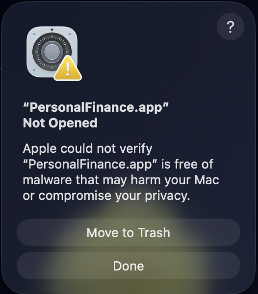
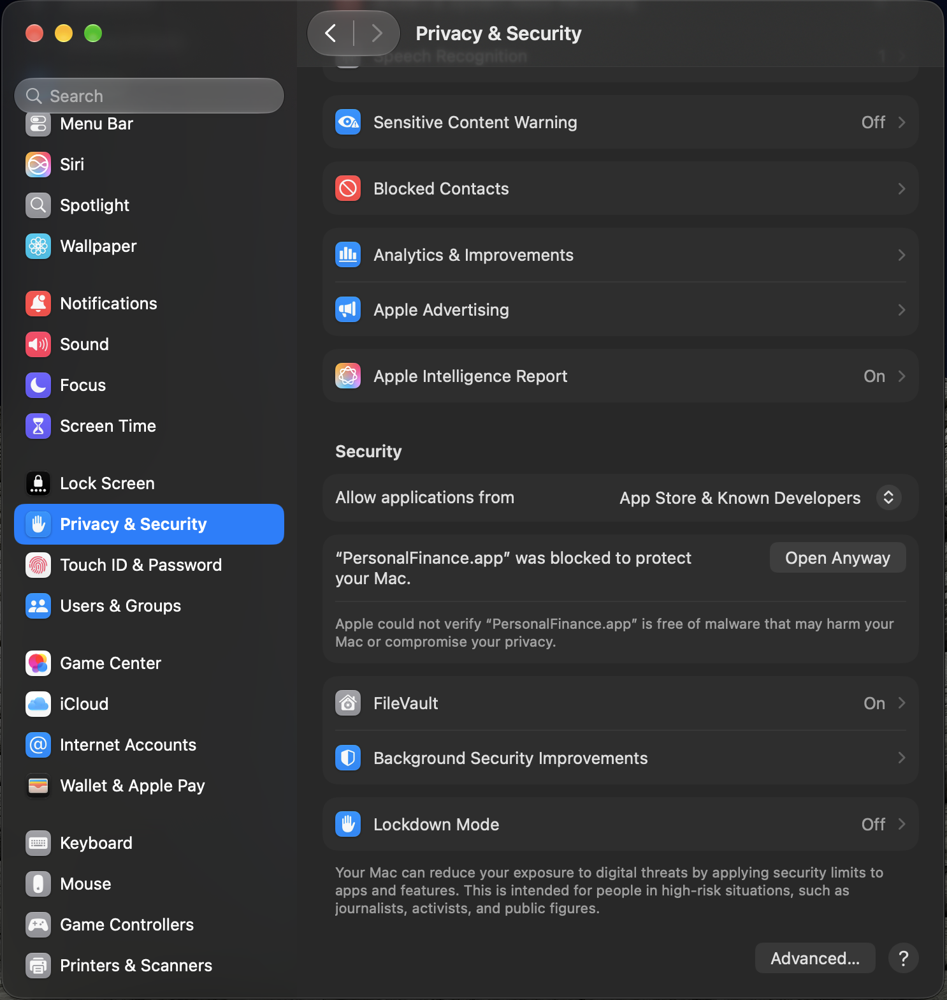
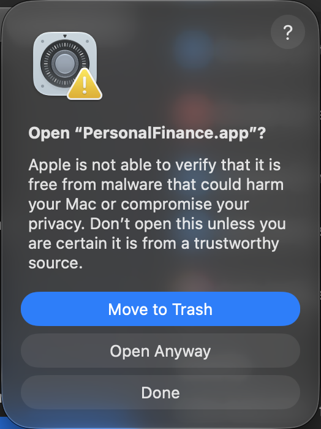

<div align="center">

# 💰 Personal Finance

### A modern personal finance manager for macOS and the web.

Track income, expenses, budgets, accounts, savings, loans, credit cards, EMI plans, transfers, and reports in one focused workspace.

<br>

[](../../releases)
[](../../releases)
[](../../releases)
[](https://personalfinance-webapp.vercel.app/)

<br>

<a href="https://personalfinance-webapp.vercel.app/">
  <strong>🚀 Open the Web App →</strong>
</a>

</div>

---

## ✨ What is Personal Finance?

**Personal Finance** is a personal money-management workspace built around a simple idea:

> **See where your money is. Understand where it goes. Plan what comes next.**

It brings everyday financial tracking into one focused dashboard instead of spreading it across spreadsheets, banking apps, notes, and separate calculators.

Whether you're tracking monthly spending, planning budgets, managing a credit card, monitoring loans, or keeping an eye on upcoming EMI payments, everything stays in one place.

---

## 🖥️ Available on macOS & Web

| | macOS | Web |
|---|---|---|
| Dashboard | ✅ | ✅ |
| Transactions | ✅ | ✅ |
| Income tracking | ✅ | ✅ |
| Master Budget | ✅ | ✅ |
| Monthly Budget | ✅ | ✅ |
| Accounts | ✅ | ✅ |
| Savings | ✅ | ✅ |
| Loans | ✅ | ✅ |
| Credit Cards | ✅ | ✅ |
| EMI | ✅ | ✅ |
| Transfers | ✅ | ✅ |
| Reports | ✅ | ✅ |
| Cloud Sync | ✅ | ✅ |
| Offline tracking | ✅ | — |
| Backup & Restore | ✅ | ✅ |

### 🌐 Try it in your browser

<div align="center">

### [Open Personal Finance Web App →](https://personalfinance-webapp.vercel.app/)

No installation required.

</div>

---

## 📊 One Dashboard. Your Entire Financial Picture.

The dashboard gives you a quick overview of the numbers that matter most:

**Monthly overview**
- 💵 Income
- 🛒 Expense
- 🎯 Budget Remaining

**Overall financial position**
- 🏦 Total Asset
- 💳 Net Available Money

**Visual insights**
- Spending by Category
- Budget vs Actual
- Income vs Expense
- Upcoming Payments
- Account Balances

The goal is to make your financial position understandable at a glance.

---

## 💳 Smart Credit Card Tracking

Credit card availability is calculated using the actual obligations affecting your available limit:

```text
Available Credit
= Credit Limit
− Current Outstanding
− Unsettled / Pending Card Purchases
− Remaining EMI Amount
```

This means pending purchases and remaining EMI obligations are accounted for instead of treating the credit limit as simply:

```text
Credit Limit − Statement Balance
```

---

## 🧩 Everything You Need

### 📊 Dashboard
A visual overview of your financial position, monthly performance, budgets, and upcoming obligations.

### 📋 Master Budget
Define your overall spending plan and organize categories around your financial goals.

### 📅 Monthly Budget
Plan and review your spending month by month.

### 💸 Transactions
Record and manage everyday income, expenses, transfers, and card activity.

### 💰 Income
Keep your income sources organized and track monthly income.

### 🏦 Accounts
Manage bank and cash accounts and monitor balances.

### 💎 Savings
Track savings separately from everyday spending money.

### 🤝 Loans
Manage receivables and payables with individual loan records.

### 💳 Credit Cards
Track credit limits, outstanding balances, pending purchases, and available credit.

### 🧾 EMI
Keep installment plans and upcoming payments organized.

### 🔄 Transfers
Move money between accounts while keeping the ledger organized.

### 📈 Reports
Review financial activity and understand spending patterns.

### ☁️ Cloud Sync
Keep your finance data synchronized across supported devices.

### 💾 Backup & Restore
Create backups of your financial data and restore them when needed.

---

## 🔐 Privacy & Security

Personal finance data is sensitive.

This public repository intentionally does **not** contain application source code or private financial data. Do not publish passwords, authentication tokens, API keys, bank account numbers, card numbers, transaction exports, or private database files.

---

## ⚠️ macOS First-Launch Security Warning

When the macOS app is downloaded directly from GitHub Releases or another source outside the Mac App Store, **macOS Gatekeeper may show a security warning before the first launch**.

You may see a message similar to:

> **“PersonalFinance.app” Not Opened**  
> Apple could not verify that “PersonalFinance.app” is free of malware that may harm your Mac or compromise your privacy.

This warning is generated by **macOS Gatekeeper**. It does not mean that Personal Finance has been identified as malware; it means macOS could not verify the app through the trust mechanism available on your Mac.

### How to open the app

If you downloaded the application from the official Personal Finance GitHub Release and trust the source, macOS provides an **Open Anyway** option.

#### 1. Try opening PersonalFinance.app

The first launch may show the Gatekeeper warning:

<p align="center">
  
</p>

#### 2. Open Privacy & Security

Go to:

**System Settings → Privacy & Security**

Scroll to the **Security** section. You may see that **PersonalFinance.app was blocked to protect your Mac** with an **Open Anyway** button.

<p align="center">
  
</p>

Click **Open Anyway**.

#### 3. Confirm the launch

macOS may show one more confirmation dialog. Review the source of the application and select **Open Anyway** if you trust the release you downloaded.

<p align="center">
  
</p>

After confirmation, Personal Finance should launch normally.

> **Important:** Only bypass Gatekeeper for an application obtained from a source you trust. If the app was downloaded from an unknown or modified source, do not bypass the warning.

### Why does this happen?

macOS uses **Gatekeeper** to protect users from applications that it cannot verify through Apple's security and trust mechanisms. Applications distributed independently of the Mac App Store can require an additional confirmation on first launch, depending on their signing, notarization, distribution method, and the security state of the Mac.

For the safest experience, always download Personal Finance from the project's official **GitHub Releases** page and verify that the release version matches the version you intended to install.

---

## 📦 Production Release

### `v1.0 · Build 125`

This is the **first production release** of Personal Finance.

**macOS**
- Native macOS application
- Offline tracking
- Cloud synchronization
- Notifications
- Backup & restore

**Web**
- Browser-based access
- Cloud-backed data
- Responsive interface
- No installation required

### Download macOS

**[Download the latest macOS release →](../../releases)**

---

## 🚀 Getting Started

### macOS

1. Open the [Releases](../../releases) page.
2. Download the latest production macOS release.
3. Open the downloaded DMG/ZIP.
4. Move **PersonalFinance.app** to Applications.
5. If macOS shows the Gatekeeper warning, follow the [First-Launch Security Warning](#-macos-first-launch-security-warning) steps above.
6. Launch the app.
7. Sign in or choose offline tracking.

### Web

1. Open **[personalfinance-webapp.vercel.app](https://personalfinance-webapp.vercel.app/)**.
2. Sign in with your Personal Finance account.
3. Start managing your finances.

---

## 🛠️ Product Structure

Personal Finance is available as two user-facing applications:

```text
Personal Finance
│
├── 🍎 macOS App
│   ├── Native SwiftUI interface
│   ├── Offline tracking
│   ├── Cloud synchronization
│   ├── Notifications
│   └── Backup & restore
│
└── 🌐 Web App
    ├── Browser-based access
    ├── Cloud-backed data
    ├── Responsive interface
    └── Cross-device access
```

The public repository contains product documentation and release information. **Application source code is intentionally not published here.**

---

## 🆘 Support & Bug Reports

For bugs or feature requests, open a GitHub issue and include:

1. Platform — macOS or Web
2. App version/build
3. Steps to reproduce
4. Expected behavior
5. Actual behavior
6. Screenshot or screen recording when useful

Please do not post private financial information, passwords, access tokens, API keys, or account numbers in an issue.

---

## 📄 License

See [LICENSE](LICENSE).
